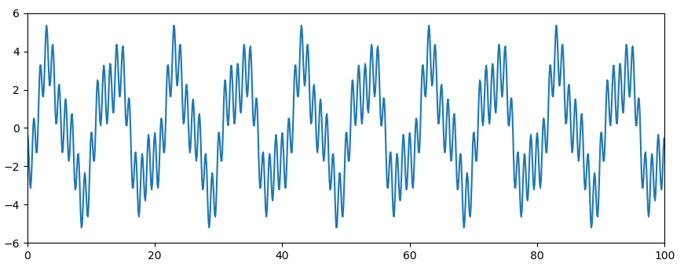
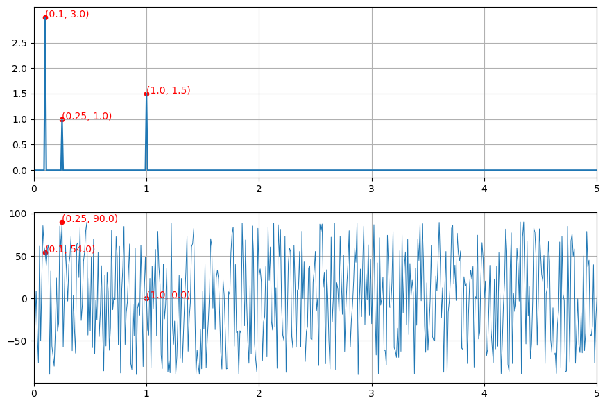
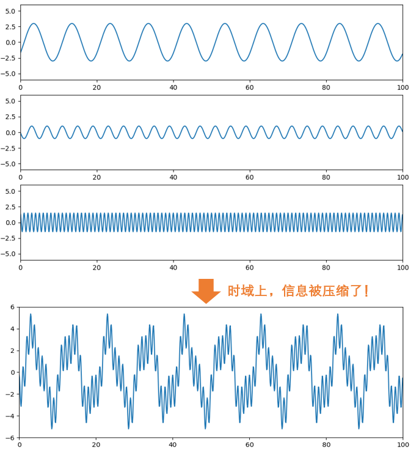
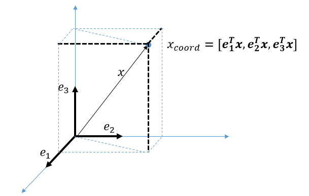

# 傅里叶变换 -- 从 Hilbert Space 到傅里叶变换基

## 1. 引言：傅里叶变换能做些什么？

熟悉 Fourier Transform 的童鞋都知道，连续 FT 的公式如下所示：

$$\mathcal{FT}(f) = \int^{+\infty}_{-\infty}{x(t)e^{-j(2{\pi}f)t}dt}$$

我们先不急于展开对这个生涩的公式（或许是久远的回忆），也不想对其中每一个元素进行细致的探索，而是 **回忆一下 FFT 的效果**

举个栗子，高中计算机老师给了两串数子 **$(t, x)$**, $t=0.1, 0.2, ...100$，希望同学们求出某函数 $x=x(t)$ 所包含的三角函数成分（如下图所示），勤奋的小白眼疾手快，一通暴力搜索后花了2个小时对着还未出来的结果十脸懵逼。

聪明的小黑脑子一转，嘿嘿嘿！不如用 Fourier Transform (FT)，然后调了个 fftpack 2 分钟搞出给了三角信号幅频-相频特性（下图），交上了作业

$$
x(t) = 3 \cdot \cos{(0.1 \cdot 2\pi t - 54^\circ)} +
       \cos{(0.25 \cdot 2\pi t - 90^\circ)} +
       1.5 \cdot \cos{(2\pi t)}
$$

瞎扯一通，我们再回顾一下题目，原本简单的信号在时域上的叠加，导致**信息被压缩了**，我们难以通过时域图形简单的判断原来的成分。  

但傅里叶变换缺可将原先压缩的信息进一步还原。换个方式表达：  
傅里叶变换 = **信号解构器**，将信号 **复杂的时域构成** 解构为 **简明清晰频域表示**  
用[【大佬的话】](https://www.zhihu.com/question/279808864/answer/498939249)来说，叫 **配方还原机**  

这里我们也不急于探索 Fouier Transform 更多的工程意义与应用，而是回过头来，  
**想问天问大地，问问我自己**，为什么 FT 能实现解构的效果

## 2. 从欧几里得(Euclidean)空间到希尔伯特(Hilbert)空间

### 2.1 欧几里得空间

欧几里得空间，又称为有限维实内积完备空间，当然了，咱不需要纠结**完备空间**、**内积空间**、**有限维** 等概念与字眼。以三维欧几里得空间为例（如下图所示），咱只需要知道：

- **空间内积的定义**：

$$\boldsymbol{<x, y>} = \sum_{i=1}^{3}{x_iy_i}$$

- **空间的基**：假定该空间的基为

$$
\boldsymbol{E = [e_1, e_2, e_3]} =
\left[\begin{matrix}
1 & 0 & 0 \\\\
0 & 1 & 0 \\\\
0 & 0 & 1
\end{matrix} \right]
$$

- **向量在空间中的坐标**：假定向量为 $\boldsymbol{x}$，其坐标为该向量在各个基上的投影

$$\boldsymbol{coordinate = Ev = [e_1^Tx, e_2^Tx, e_3^Tx]}$$

### 2.2 希尔伯特空间

如果我们的目光不拘泥与有限维度，当欧几里得空间扩展为无限维度后，实质形成了 **希尔伯特空间**。与欧式空间对应的，其内积定义，空间基，与向量坐标可描述为：

- **空间内积的定义**：

$$\boldsymbol{<x(t), y(t)>} = \int_{-\infty}^{+\infty}{x(t)y(t)dt}$$

- **空间的基**：假定该空间的基某一关于参数 $\theta$ 的函数族

$$\boldsymbol{E} = [...,e(t;\theta_1), e(t;\theta_2), e(t;\theta_3), ...]$$

- **向量在空间中的坐标**：假定向量为 $\boldsymbol{x}(t)$，其坐标为该向量在各个基上的投影

$$\boldsymbol{coordinate} =
\left[...,
    \int_{-\infty}^{+\infty}{x(t)e(t;\theta_1)dt},
    \int_{-\infty}^{+\infty}{x(t)e(t;\theta_2)dt},
    \int_{-\infty}^{+\infty}{x(t)e(t;\theta_3)dt}, ...
\right]
$$

&emsp;&emsp;&ensp; 换种方式表达：

$$coordinate(\theta) = \int_{-\infty}^{+\infty}{x(t)e(t;\theta)dt}$$

## 3. 从 Hilbert Space 到傅里叶变换基

回顾希尔伯特空间中的 **坐标表示** 与 **傅里叶变换** 公式

$$ \left\{
\begin{aligned}
coordinate(\theta) = & \int_{-\infty}^{+\infty}{x(t)e(t;\theta)dt} \\
\mathcal{FT}(f) = & \int^{+\infty}_{-\infty}{x(t)e^{-j(2{\pi}f)t}dt}  
\end{aligned}
\right.
$$

我们不难发现，傅里叶变换其实是希尔伯特空间中一种特殊的坐标表示方式，该坐标的基为三角函数族

$$
\begin{aligned}
\boldsymbol{E_{fourier}} = & [..., e(t;\theta_1), e(t;\theta_2), e(t;\theta_3), ...] \\
               = & [..., e^{-j(2{\pi}f_1)t}, e^{-j(2{\pi}f_2)t}, e^{-j(2{\pi}f_3)t}, ...]
\end{aligned}
$$

换句话说，傅里叶变换其实是希尔伯特空间中，以
**三角函数族基$E_{fourier}$**
取代正常基$^*\boldsymbol{E_{normal}}$的
**坐标表示方法**。  
大家都在希尔伯特空间里面，只不过我正常用 $\boldsymbol{E_{normal}}$ 看信号，发现 $x(t)$ 过于复杂看不太懂，
**那我便换个角度，用 $\boldsymbol{E_{fourier}}$ 来观测信号**

> $^*\boldsymbol{E_{normal}}$ 指狄拉克函数形成的基  
> $$\boldsymbol{E_{normal}} = [...,\delta(t - t_1), \delta(t - t_2), \delta(t - t_3),...]$$
> &ensp;满足 $coordinate(t_i)  = x(t_i) = \int_{-\infty}^{+\infty}{x(t)\delta(t - t_i)dt}$

.gif)

## 4. XXX变换 -- 变换的是观察的视角

说到这里，想想当初在线性代数中学习的坐标变换，或许不仅仅是在教我们如何从一个坐标系变换到另一个坐标系，maybe 更隐含一层 zhexue 意思：尝试用**不同的角度**对一个现象进行观察，或许可以得到一些**被压缩、隐秘起来的信息**（说远了，doge）

说回来，不仅仅是傅里叶变换，包括控制人熟悉的拉普拉斯变换，信号人熟知的小波变换，乃至神经网络的非线性变换，从本文的立意出发，都可视作基于不同的角度（不同的坐标基）观测信号，**使之成分清晰，意义明确**

一些理解与夹带私货的想法，希望能有所助益~
